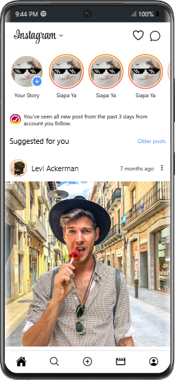

# Project Instagram Clone menggunakan React Native dengan Expo dan Tamagui

Proyek ini adalah aplikasi cloning Instagram dengan React Native yang menggunakan Expo untuk pengembangan dan Tamagui sebagai library styling.

## Persyaratan

Pastikan Anda memiliki perangkat lunak berikut yang terinstal di sistem Anda:

- [Node.js](https://nodejs.org/) (disarankan versi LTS)
- [Expo CLI](https://docs.expo.dev/get-started/installation/)
- [Yarn](https://yarnpkg.com/) atau [npm](https://www.npmjs.com/)

## Instalasi

1. **Clone repositori:**

   ```bash
   git clone https://github.com/HadiatAbdulBashit/Instagram-Clone-React-Native
   cd nama-repo
   ```

2. **Instal dependencies:**

   Jika menggunakan Yarn:

   ```bash
   yarn install
   ```

   Jika menggunakan npm:

   ```bash
   npm install
   ```

   Ikuti panduan di [dokumentasi Tamagui](https://tamagui.dev/docs/intro/installation) untuk melakukan konfigurasi lebih lanjut jika diperlukan.

## Menjalankan Aplikasi

1. **Jalankan server Expo:**

   ```bash
   yarn start
   ```

   atau

   ```bash
   npm start
   ```

2. **Membuka aplikasi di perangkat:**

   - **Android:** Scan QR code dengan Expo Go.
   - **iOS:** Scan QR code dengan aplikasi Kamera di perangkat iOS, kemudian pilih untuk membuka di Expo Go.
   - **Web:** Pilih opsi untuk menjalankan di browser pada terminal yang muncul.

## Preview


